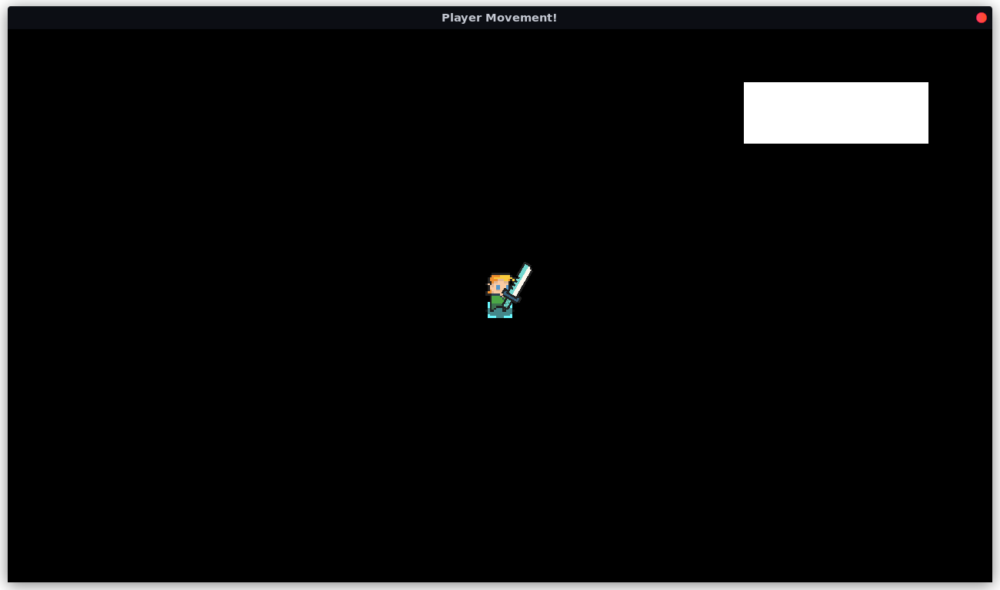

# GCSE Non-Examined Assessment

> by Lenny Critchley, 2022

---

## Table of Contents

1. [Table of Contents](#table-of-contents)
2. [Task Introduction](#task-introduction)
   * [User Experience](#user-experience)
3. [Design](#design)
   * [Libraries we need](#libraries-we-need)
   * [Application](#application)
   * [Main Menu](#main-menu)
   * [Settings Menu](#settings-menu)
   * [Play Menu](#play-menu)
   * [Lobby Menu](#lobby-menu)
   * [Physics System](#physics-system)
     * [Space](#space)
     * [Object 2D](#object-2d)
     * [AABB](#aabb)
     * [Collision Data](#collision-data)
     * [Get Axis Collision Distances](#get-axis-collision-distances)
     * [Get Axis Collision Times](#get-axis-collision-times)
     * [Get Collision Normals](#get-collision-normals)
     * [Body](#body)
   * [Game Manager](#game-manager)
   * [Tile Data](#tile-data)
   * [Tile](#tile)
   * [Dungeon](#dungeon)
   * [Requesting Rooms](#requesting-rooms)
   * [Room](#room)
   * [Entity](#entity)
   * [Player](#player)
   * [Enemy](#enemy)
4. [Implementation](#implementation)
   * [Physics System](#physics-system)

## Task Introduction

The task was to write a graphical game that can be played from any common desktop operating system (such as Windows, MacOS and common Linux distros).

I plan to develop a procedurally-generated[^1] roguelite[^2] game, using top-down graphics and a full 2D physics system. If possible, I also plan to implement multiplayer networking in the game.

[^1]: <https://en.wikipedia.org/wiki/Procedural_generation>
[^2]: [Roguelikes (Wikipedia)](https://en.wikipedia.org/wiki/Roguelike), [Roguelites (Wikipedia)](https://en.wikipedia.org/wiki/Roguelite)

### User Experience

- Opens into main menu.
- Play:
  - Leads to host/connect screen.
  - Hosting allows the user to create a new lobby that others can join.
  - Connect allows the user to enter an IP:Port pair and join another user's lobby.
  - Lobby screen should list players and their chosen classes, allows kicking and have a chat window.
  - Once all players are ready, the owner may start the game.
- In Game:
  - Each player begins with a chosen class.
  - Players should start in room, one exit must be present.
  - Players can attack and dash, as well as moving normally with the arrow keys or WASD.
  - Each player has 2 weapon slots and 2 item slots.
  - Selected item can be changed with num keys and scroll wheel.
  - Room is tile based with auto-tiling for smoother textures.
  - Mini-map at top right for discovered rooms.
  - Players can see other player’s locations on the map, but not their discovered rooms!
  - Objective is to find the exit room.
  - Rooms along the way may contain new items (combat rooms) or new weapons (chest rooms), or may even contain a shop.
  - Enemies should drop money and health in order to reward combat, and should have different strengths and weaknesses to make multiple classes more important.
  - Exit room encounter should be more difficult than rest of the dungeon.
  - Upon exit room, new dungeon should be generated once all players enter.
  - Upon death, players may spectate other living players.
- Settings:-
  - Audio volume,
  - Controls,
  - Networking,
  - Display (for UI scaling and window size, etc).
- Info:
  - Credits and more detailed information about this task.

## Design

### Libraries we need

This project will require some form of graphics rendering library, it will manage window creation and the process of interacting with the GPU to draw sprites and images to the screen.

I have chosen to use the [pyglet](http://pyglet.org/) Python library. For dependency management, I am using the [poetry](https://python-poetry.org/) tool, which is used to isolate packages and avoid polluting the developer's global package list. This will not affect the project itself much and is purely an organisational decision.

In addition to pyglet itself, we will also need some form of 3D sprite implementation so we can layer sprites on top of each-other in a performant manner. I have chosen to use [this](https://github.com/LennyPhoenix/GCSE-CS-NEA/blob/main/src/zsprite.py) implementation.

### Application

I will need some form of core application class to manage the event loop, window, and game state. This is the "master" object.

**States:**

- Main Menu - The application is displaying the main menu.
- Play Menu - The application is displaying the host/join menu.
- Lobby Menu - The application is displaying the lobby menu.
- In Game - The player is in the game loop.
- Settings Menu - The application is displaying the settings menu.

The default state will be whatever we are currently developing to speed up the process, if the project is finished it should be the Main Menu.

**Constants:**

- Default Window Size: Vector 2 - The default size of the game window (in pixels). 1280 x 720 (720p) is pretty standard.

**Attributes:**

- Main Menu - State manager for the main menu.
- Play Menu - State manager for the "play" menu.
- Lobby Menu - State manager for the lobby menu.
- Game Manager - State manager for the game itself.
- Settings Menu - State manager for the settings menu.
- Network Manager - Controls networking (client-server) functionality.
- Window - The graphics window itself.
- Keys - The key state handler so we can see what keys are currently held.
- Batch - The graphics batch we will be drawing.
- Current State - The current state of the application. When changed, initialise the needed state manager to replace the previous one.

**Methods:**

- *On Draw*
  - Pyglet event for redrawing, will clear the window and draw the graphics batch.
- *On Key Press*
  - Pyglet event when a key is pressed down, will control fullscreen and send the event to necessary managers.
- *On Mouse Press*, *On Mouse Motion*, and *On Mouse Drag*
  - Like *On Key Press* but for mouse buttons and motion.
- *On Text Entry*
  - Text entry event for text boxes, send to necessary managers.
- *On Update*
  - Scheduled function called every frame, should be sent to necessary managers.
- *On Disconnected*
  - Sets the state back to the Play Menu.
- *Run*
  - Starts the event loop.

### Main Menu

The state manager for the main menu. Contains the UI elements for the menu, including buttons and background art.

**Attributes:**

- Background - Sprite for the background image.
- Title - Label for the game title.
- Play Button - Button to load the "Play Menu".
- Settings Button - Button to load the "Settings Menu".
- Info Button - Button to display the info screen.
- Info Box - A simple text box containing game info.

**Methods:**

- *On Mouse Press*, *On Mouse Motion*, and *On Mouse Drag*
  - Mouse events to send to buttons.

**Events:**

- *Menu Selected*
  - Sends the menu that was opened so the application can change state.

### Settings Menu

The state manager for the settings menu. Contains UI elements for the menu, including sliders, buttons and text for setting descriptions.

**Constants:**

- Settings Path - The file path to the settings JSON file.

**Methods:**

- *On Mouse Press*, *On Mouse Motion*, and *On Mouse Drag*
  - Mouse events to send to buttons.
- *Save Settings* - Stores the current settings to the JSON file using the JSON module.
- *Load Settings* - Loads the settings file using the JSON module and applies them.

**Events:**

- *Menu Closed*
  - Tells the application to change back to the main menu state.

### Play Menu

The state manager for the "play menu". Contains the UI elements for the host and join screens.

**Attributes:**

- Play Menu Group - Rendering group for the "play menu".
  - Username Entry Box
  - Host Button
  - Join Button
- Host Menu Group - Rendering group for the "host menu".
  - Port Entry Box
  - Passcode Entry Box
  - Start Button
- Join Menu Group - Rendering group for the "join menu".
  - IP Entry Box
  - Port Entry Box
  - Join Button

**Methods:**

- *On Mouse Press*, *On Mouse Motion*, and *On Mouse Drag*
  - Mouse events to send to buttons.
- *On Text Entry*
  - Text entry event for text boxes.

**Events:**

- *Lobby Hosted*
  - Tells the application to open a server on the network manager, if successful switches to the lobby menu state.
- *Lobby Selected*
  - Tells the application to attempt to connect to a server on the network manager, if successful switches to the lobby menu state.

### Lobby Menu

The state manager for the "lobby menu". Contains the UI elements for player options in the game, including player classes.

**Attributes:**

- Player List
- Class Selection Dropdown
- IP:Port Pair Display
- Chat Window - Displays messages from other players as labels, has a message entry box.
- Network Manager - Reference to the application network manager.

**Methods:**

- *On Mouse Press*, *On Mouse Motion*, and *On Mouse Drag*
  - Mouse events to send to buttons.
- *On Text Entry*
  - Text entry event for text boxes.
- *On Player Message*
  - Event called when a player sends a message.
- *On Player Joined*
  - Event called when a player joins.
- *On Player Left*
  - Event called when a player leaves.
- *On Player Class Changed*
  - Event called when a player changes their class.

**Events:**

- *Game Starting*
  - Tells the application to switch to the in-game state.
  - Sends the application the current player's class.

### Physics System

I have opted to avoid using a library like Pymunk for my physics system as it provides too many unnecessary tools that ultimately make the game's codebase more complex than it needs to be.

My physics system needs to do a few basic things, and nothing more:

- Allow objects to detect collisions between each other
- Resolve collisions and avoid tunneling (using swept AABBs[^3])
- Mask out specific collision layers
  - e.g. enemies + enemy bullets do not need to collide
- Allow "move and slide" behaviour

  

Something simple such as swept AABB collisions can solve this problem very easily and efficiently.

Once the physics system is correctly implemented we can begin work on the gameplay.

#### Space

The "space" is essentially the collection of physics entities.

In this case it can be implemented simply by defining the Space as a Python Set of [AABBs](#aabb).

#### Object 2D

This allows objects to be represented in 2D space, with positional inheritance.

Consider an object with no parent, the local and global position of that object will be equal as the object is in global space directly. If that object had another object as a parent, its position would be relative to the location of the parent object. The local position will no longer be equal to the global position as the global position is now equal to the local position *transformed by* the parent's global position, which in turn is calculated by the parent's parent's global position...

**Attributes:**

- x: float - The local X position of the object.
- y: float - The local Y position of the object.
- parent: Object 2D - The object's parent in space, may be None.
- global x: float - The global X position of the object.
- global y: float - The global Y position of the object.

#### AABB

An axis-aligned bounding box[^3], contains the logic for collision **detection** *(as opposed to resolution)*.
AABBs are represented as a position at the bottom-left, and a width and height extending to the top-right.
Inherits from Object 2D.

**Attributes:**

- *All of Object 2D.*
- w: float - The width of the box.
- h: float - The height of the box.
- layer: int - The bitmask of the layers this box may be detected on.

**Methods:**

- *Is colliding AABB?*
  - Checks if the current AABB is intersecting with another given AABB.
  - Returns a boolean.
- *Is colliding point?*
  - Checks if a given point is within the boundaries of the current AABB.
  - Returns a boolean.
- *Get broad phase*
  - Creates a new broad-phase AABB for the current AABB and a given velocity.
  - This is used later for optimising collision resolution, a broad phase is essentially the total area the AABB could move through when travelling via a given transformation.
  - For example, box A is located at (10, 60) with a width and height of (20, 20), when box A moves by a transformation (100, -60), its broad-phase will be at (0, 10) with a width and height of (120, 80).

  
  
  - Returns a new AABB.

For testing and debugging purposes, we also will want some helper debugging methods:

- *Create Debug Rect*
  - Creates a new Rectangle shape, allowing the AABB to be displayed on screen.
  - Takes some basic options: colour, batch, and group.
- *Update Debug Rect*
  - Updates the position, width, and height to reflect the current properties

#### Collision Data

We need some way to store the data of a collision (whether the collision happened or not, the time during the transformation it happened, and the normals of the collision) easily.
To do this I will define a Python dataclass to store these attributes together.

#### Get Axis Collision Distances

This function will be used to calculate the distance to the entry and exit poitns of a collision on a **1D** axis.

Takes the positions and widths of two objects in 1D space, and the velocity of the first object.

Returns the entry and exit distances in a tuple.

#### Get Axis Collision Times

This function will be used to calculate the entry and exit times for a collision in **1D** space. Time returned is a float between 0.0 and 1.0, with 0.0 being right at the start of the motion and 1.0 being right at the end.

Takes the distance to the entry and exit points and the velocity of the object.

Returns the entry and exit times in a tuple.

#### Get Collision Normals

This function will be used to calculate the normals of a collision in **2D** space.

Takes entry times and entry distances both as 2D vectors.

Returns the normals as a 2D vector.

#### Body

A moving AABB in space. Will find the nearest/earliest collision in space and resolve the collision based on the body's velocity.

**Attributes:**

- *All of AABB*
- mask: int - The bitmask of the layers this body may detect/collide with.

**Methods:**

- *Get Collision Data*
  - Determines all the appropriate data surrounding the collision of the body with another AABB, and compiles the data into a `CollisionData` object.
  - Will need to calculate whether a collision has actually occured. A collision occurs if non of the following are true:
    - There was no motion, this happens if the entry time is greater than the exit time.
    - The collision happened in the past.
    - The collision happens more than 1 frame in the future.
  - Takes another AABB, and the body's velocity as arguments.
  - Returns the `CollisionData` object.
- *Get Nearest Collision*
  - Loops over all objects in space, and determines which object collides with the body first using the *Get Collision Data* method. The collision with the lowest entry time is the earliest.
  - We can use the AABB's broad-phase here to determine if a collision is even possible.
  - Takes the physics space (remember this is a Set of AABBs) and the body's velocity as arguments.
  - Returns the collision data of the earliest collision.
- *Move*
  - Gets the nearest collision and moves as far as possible in one iteration.
  - Takes the physics space and the body's velocity as arguments.
  - The body may move by the given velocity multiplied by the collision time. Because the collision time is a float between 0 and 1, a collision that happens half-way between frames will have a collision time of `0.5`. Multiplying the velocity by `0.5` will make the body travel half the distance, stopping it at the point of the collision.
  - We can then determine the remaining "deflection" velocity by using the normals of the collision in some vector maths.
  - Returns the remaining velocity as a 2D vector.
- *Move and Slide*
  - Repeatedly runs the *Move* function until the remaining velocity reaches a magnitude of 0, *or* if the maximum number of bounces[^4] has been reached.
  - Takes the physics space, the body's velocity and *optionally* the maximum number of bounces that may occur.

[^3]: [gamedev.net](https://www.gamedev.net/articles/programming/general-and-gameplay-programming/swept-aabb-collision-detection-and-response-r3084/) [amanotes.com](https://www.amanotes.com/post/using-swept-aabb-to-detect-and-process-collision)
[^4]: Each collision is a bounce in this case.

### Game Manager

The state manager for all game processes. 

**Attributes:**

- Dungeon - The dungeon manager.
- Space - The physics space.
- Player - Reference to the player object.
- Players: dict - Dictionary of player objects, e.g. `{"Username": Player}`.
- Entity List: dict - Dictionary of entity objects, e.g. `{ID: Entity}`.
- Chat Window - Another instance of the chat window class from the Lobby Menu.
- Waiting For Room: 2D Vector (Or `None`) - Position of the room the game is currently waiting for from the server.

**Methods:**

- *Get Room*
  - Load the room object (if applicable) using the [Dungeon's](#dungeon) *Load Room* method.
  - If the room is `None` or has not been generated yet then do the following:
  - **Client Mode:**
    - Emit the *Room Request* event to the network manager.
    - Returns None.
  - **Server Mode:**
    - Attempt to generate the room layout via the room's *Generate* method.
    - Returns the generated room.
  - **Otherwise** return the room object loaded from the Dungeon.
- *Change Room*
  - Takes a new room position.
  - If Waiting For Room is `None`:
    - Begin room transition animation.
    - Disable all entities by removing them from the physics space.
    - Runs *Get Room* for the position given.
    - If room is `None`, set Waiting For Room to the position requested and return early.
  - Run *Change Room* on the **Dungeon**.
  - Move player to entrance of new room. Set player's room to the newly loaded room.
  - Loop over ever entity and check the entity's room, if it matches the current room then enable the entity by assigning the correct physics space to the entity.
  - End room transition animation.
- *On Update*
  - Event called every frame, contains delta-time since last frame.
  - Sent to all entities that require it.
  - If player is colliding with a room door (See [Dungeon](#dungeon)), run *Change Room* for new room position.
- *On Fixed Update*
  - Event called once every fixed timestamp (in this case 60 times per second), contains delta-time since last fixed-update call.
  - Sent to all entities that require it.
- *On Mouse Press*, *On Mouse Motion*, and *On Mouse Drag*
  - Mouse-related window events.
  - Sent to the current player object.
- *On Key Press*
  - Keyboard-related window events.
  - Sent to the current player object.
- *On Player Message*
  - Event called when a player sends a message.
- *On Player Left*
  - Event called when a player leaves.
- *On Player Action*
  - Event called when a player performs any in-game action such as changing weapon.
- *On Entity Sync*
  - Event called when an entity changes, is created, or is destroyed.
  - Contains the data that was changed, or the data for the new entity.
  - Upon receiving an entity, check if the ID is located within the Entities dict's keys. If not, add the entity to the dictionary and assign the **Entity's** Last ID to `max(New Entity->ID, Entity->Last ID)`.
  - Changes include movement between rooms.
- *On Room Received*
  - Event called when the data for a requested room is received.
  - Propagate to the Dungeon object.
  - If Waiting For Room is not `None`:
    - If the data is `None`, run *Change Room* for player's previous position.
    - Otherwise, run *Change Room* for the Waiting For Room position.
    - Set Waiting For Room to `None`.
- *On Room Request*
  - A room has been requested by another user.
  - Run *Get Room* and send the result to the network manager, even if it is not part of the room plan of the dungeon. (In this case it would be `None`)

**Events:**

- *Player Message*
  - The user has sent a message to chat.
- *Player Action*
  - The user has performed some action.
- *Room Request*
  - The user has moved to a new room.

### Camera

A graphics group allowing the viewport to be moved around in 2D space.

**Constants:**

- View Resolution: 2D Vector - The target resolution to achieve, in pixels.

**Attributes:**

- Position: Object 2D - Position reference, allowing the camera to have a parent and a local position.
- Zoom: float - The amount of "zoom" applied to the camera.
- Window Size: 2D Vector - Stores the window's size in pixels.

**Methods:**

- *On Window Resize*
  - Called every time the window is resized.
  - Takes the new width and height, and stores them in Window Size.
- *Get Viewport Scale*
  - Calculates the amount that the viewport should be scaled by reach the intended resolution.
  - It will aim to keep everything in view, so we use the smaller of the two zooms, like so:

    ```python
    scale = min(
        self.window_size.x / self.VIEW_RESOLUTION.x,
        self.window_size.y / self.VIEW_RESOLUTION.y
    )

    ```

  - Returns this scale.
- *Set State*
  - Method for graphics groups called at the start of the draw call.
  - This should apply the zoom and camera positioning.
  - This is done through a zoom matrix.
- *Unset State*
  - Reverses *Set State*, called at the end of the draw call.
  - Essentially applies the reverse matrix.

### Tile Data

Dataclass for storing Tile Data.

**Attributes:**

- Sprite Path: string - The filepath to the sprite's image.
- Autotile: bool - Whether the sprite should autotile. If true, the sprite will use the bitmask algorithm when being displayed, otherwise a random tile is picked from the image.
- Size: 2D Vector - The size of the tile sprite, e.g. `Vec2(16, 16)` for a width and height of 16 pixels.
- Sprite Grid: Image Grid - Grid of each tile sprite from the Sprite Path, calculated at runtime.
- Collider: AABB - [Axis-aligned bounding box](#aabb) of the tile (with offset and layer).

### Tile

Physical tile object. Inherits Object 2D.

**Attributes:**

- *All of Object2D*
- Sprite - The tile sprite.
- AABB - The collision AABB for the tile.
- Data - The tile's corresponding data.
- Space - The physics space to use.

### Dungeon

Class containing dungeon data, and managing the state of dungeon rooms and entities.

**Constants:**

- Tile Types: dict - Python dictionary of tile IDs to Tile Data objects.
- Max Room Size: 2D Vector - The largest possible size a room can be.

**Attributes:**

- Rooms - A dictionary mapping positions (as 2D vectors) to Room objects. `{Vec2(X, Y): Room}`
- Tiles: 2D Array - A 2D array of tile sprites, the size of the Max Room Size.
- Door AABBs - Door colliders corresponding to the four possible doors in a room. 
- Space - Reference to the physics space.

**Methods:**

- *Generate Layout*
  - Generates a dungeon room map and stores it in the rooms dictionary.
- *Load Room*
  - Attempts to access a room, returning None if it does not exist in the room map.
  - If the room does not yet have a tile-layout or an entity pool:
    - Client Mode: Attempt to request the room layout from the server via the network manager. Returns the ungenerated room.
    - Server Mode: Attempt to generate the room layout via the room's *Generate* method. Returns the generated room.
- *Switch Room*
  - Takes a room object.
  - Iterate over each sprite in Tile Sprites and compares the position to the **Room**'s Tilemap.
  - Gets the corresponding tile data for the tile ID in the tilemap.
  - If the tile data is `None`:
    - Set the tile to be invisible.
    - Remove the tile's AABB from the physics space, if applicable.
  - Otherwise:
    - Set the tile sprite to be visible.
    - If the tile uses autotiling, get the position using *Get Autotiling Position*.
    - Otherwise, get a random tile from the sprite grid.
    - If the tile AABB is not `None`, create a new AABB for the tile and copy all appropriate properties from the tile data AABB. These include the position, extension, and the layer of the tile.
    - Set the tile AABB parent to be the tile itself.
    - Add the tile AABB to the physics space.
  - Move door AABBs to the corresponding door locations in the room.
- *Get Autotiling Position*
  - Takes a tile position and a tilemap, checks all adjacent tiles and combines into a bitmask.
  - Compares bitmask with a harcoded dictionary to find the position of the tile on a standard autotiling image grid.
  - Returns the position.
- *On Room Received*
  - Room data received event, stores the room data in the Rooms dictionary.

### Requesting Rooms

The process for requesting rooms now looks something like this:


### Room

Object to store room information.

**Room Types:**

- Start
- End
- Shop
- Chest
- Fight

**Attributes:**

- Type - The room's generation type.
- Cleared: bool - Whether the room has been completed. Only relevant to End and Fight room types.
- Doors: bitmask - 4-bit long bitmask of the valid doors in the room, starting North and going clockwise (`N->E->S->W`). `1101` means North, East, and West are valid doors, East is not.
- Size: 2D Vector - The width and height of the room, including walls and doors.
- Tiles: 2D Array - Tilemap of the room layout, consisting of Tile IDs in a 2D array.
- Entities: Set - List of entities in the room.

**Methods:**

- *Generate*
  - Generates a tilemap and set of entities based on the room's type and doors.
  - Uses a procedural generation algorithm.
  - Algorithm:

    ```python
    size += Vec2(6, 6)
    tiles = [[0 for x in range(size.x)] for y in range(size.y)]

    # Room Shape
    for x in range(size.x):
        for y in range(size.y):
            # Outer Walls
            if 3 > x >= size.x-3 or 3 > y >= size.y-3:
                tile = tile.WALL

            # Doorways
            if x in [size.x//2, size.x//2 - 1, size.x//2 + 1)]:
                # North
                if y > size.y//2 and doors & 1000:
                    tile = tile.FLOOR

                # South
                if y < size.y//2 and doors & 0010:
                    tile = tile.FLOOR

            if y in [size.y//2, size.y//2 - 1, size.y//2 + 1)]:
                # East
                if x > size.x//2 and doors & 0100:
                    tile = tile.FLOOR

                # West
                if x < size.x//2 and doors & 0001:
                    tile = tile.FLOOR

            # Central Floor
            if 3 <= x < size.x-3 and 3 <= y < size.y-3:
                tile = tile.FLOOR

            tiles[y][x] = tile

    # Generate Room Lines
    # unimplemented
    # Generate Room Blobs
    # unimplemented

    ```

### Entity

A dynamic object, anything from an item to an enemy. Inherits from **Body**.

**Class Attributes:**

- Last ID: int - The last-used numerical ID.

**Attributes:**

- *All of Body*
- ID: int - The unique ID of the entity.
- Sprite - The graphical sprite of the entity. 3D Sprites should have the Z change depending on the Y-position, simulating a 3D effect.
- Room Position: 2D Vector - The position of the room this entity is currently located within.
- Space - The physics space to use. Should use a property so that assigning a physics space adds the entity to the space, assigning a different one removes it from the old space and adds it to the new one.

**Methods:**

- *On Update*
  - Called once per frame.
  - Should update the debug rect and sprite location if something has been changed.
- *On Fixed Update*
  - Called once every 1/60th of a second.
- *Get Collisions*
  - Loops over the current physics space, and uses *Is Colliding AABB* to compile a list of collisions.
  - Should also take the Mask and Layer into account.
  - Returns this list.

### Player

The user-controlled player object, uses a state machine.

**States:**

- Idle - No movement.
- Running - Standard movement with WASD.
- Dead - The player can no longer move.
- Default - Idle.

**Constants:**

- Max Health: int - The maximum health a player can have, will probably be 100.
- Speed: float - The number of pixels the player may move per second.
- Dash Multiplier: float - The amount that the player's speed is multiplied by while sprinting.
- Dash Length: float - The amount of time a dash lasts for.
- Dash Cooldown: float - The amount of time the player must wait between dashes.
- Dash Control: float - The amount of control the player has during a dash.
- Layer: int - The player's unique collision layer.
- Sprite Sheet: Pyglet Image - The image resource used for the player sprite.
- Idle Animation: Pyglet Animation - The animation for the idle state.
- Moving Animation: Pyglet Animation - The animation corresponding to the running and dashing states.
- Dead Animation: Pyglet Animation - The animation to occure when the Dead state is reached.

**Attributes:**

- *All of Entity*
- Keys - The key state handler used to keep track of user input.
- Current State - The state currently assigned by the player object.
- Input Vector: 2D Vector - The unit vector of the user's current directional input.
- Dash Velocity: 2D Vector - Used to store the initial velocity of a dash.
- Current Weapon - The currently selected weapon, may be none.
- Camera - The camera object to control the viewport, parented by the player object.
- UI - Contains the UI for the player, including inventory, money, and health.
- Inventory - List of the items in the player's inventory. Should only be 4 in length.
- Current Selection: int - The index of the currently selected item in the player's inventory.
- Current Health: int - The current health of the player. When this reaches 0 the state changes to Dead.

**Methods:**

- *Get Input*
  - Calculates the user input vector and normalises it.
  - This is done by adding to x and y velocity variables based on held keys in the Keys handler.
  - Returns the vector.
- *On Update*
  - Called once per frame.
  - If the player is in the Dead state, do not do anything.
  - If the player is in the Dashing state, counts down on the dash timer using the delta-time passed to the function.
  - Otherwise, counts down on the dash *cooldown* timer, stores the result of *Get Input* in the Input Vector attribute, and assigns either the Idle or Running state based on if that vector is 0 or not.
  - Also sent to the current weapon.
- *On Fixed Update*
  - Called 60 times a second.
  - If the player is Dead, do not do anything and return early.
  - Flips the sprite based on if it is moving to the right or left.
  - Calculates the speed of the player based on if they are dashing or not.
  - If the player is dashing, their velocity is locked but we still add some control to make the gameplay feel more responsive.
  - Multiply the speed by the input vector to calculate a velocity.
  - Run *Move and Slide* using the velocity and the physics space.
  - Rounds the Global Position to keep it pixel-aligned.
  - If colliding with an enemy, reduce health by the enemies damage. Use *Get Collisions*.
- *On Mouse Motion*, *On Mouse Drag*, and *On Mouse Button Down*
  - Sent to the current weapon.
- *On Key Press*
  - If the key is space, determine if a dash is possible[^5], and assign the dash state accordingly along with resetting the appropriate timers.
  - Change Current Selection to follow if the number keys from 1-4 are pressed.
    - Hide the previous item and show the new one. This is done by setting the item's sprite to use `invisible=True/False`.

**Events:**

- *Action Occured*
  - The user has attempted some action, such as movement, changing item, or using an item/weapon.
  - Sent to the **Game Manager**.

[^5]: The player can dash if the Dash Cooldown Timer is less than 0, and if the Input Vector is not 0. Essentially, the cooldown timer has expired and the player is moving.

### Enemy

Each enemy type should ideally have a unique movement and attack pattern to keep the game fun and interesting. Ideally, an enemy should be strong against one class and weak against another to encourage player cooperation.

**States:**

- Idle - The enemy is not moving.
- Attacking - The enemy is in the same room as a player.
- Dead - The enemy's health is 0.

**Constants:**

- Max Health: int - The maximum health of this specific enemy.
- Damage: int - The damage dealt by an attack of this entity.
- Speed: float - The movement speed of this entity.

**Attributes:**

- *All of Entity*
- Room - Reference to the room that this enemy is located within.
- Health: int - The current health of the enemy. Like the player, the state should change to Dead when this reaches 0.

**Methods:**

- *Calculate Path*
  - Takes the Tilemap of the Room, and uses the A-Star pathfinding algorithm to calculate a path towards a given location.
  - Returns the tiles in this path.
- *On Update*
  - If the state is Attacking, calculate a path towards the target location.
  - For melee enemies, the target location will be the position of the nearest player located in this enemy's physics space.
- *On Fixed Update*
  - Follow this path, when reaching a tile on the path, remove it from the path.
  - Use *Move and Slide* to move towards the target velocity.
  - If colliding with a player's weapon or projectile, reduce health by the weapon or projectile's damage. Use *Get Collisions*.

**Events:**

- *State Changed*
  - In server mode, occurs if an attribute of the entity is changed.

### Weapon Stats

Dataclass for storing a weapon's stats.

**Attributes:**

- Damage: float - The damage this weapon deals.
- Cooldown: float - The amount of time between uses that the player must wait.
- Speed: float - The speed that the weapon travels through space. (Melee Only)
- Range: float - The size of the weapon collider. (Melee Only)
- Projectile - The projectile to fire. (Range Only)

### Weapon

An in-game representation of a weapon. Should be parented by the **Player**.

**Types:**

- Melee
- Ranged

**Constants:**

- Type - This weapon's type.
- Stats - This weapon's stats.
- Idle: Pyglet Animation - The weapon animation to play when not being used.
- Use: Pyglet Animation - The animation to play during use.

**Attributes:**

- *All of Object 2D*
- Space - The physics space this weapon should use.
- Sprite - The weapon's sprite.

**Methods:**

- *On Mouse Motion*, *On Mouse Drag*
  - Used to rotate the weapon sprite to point towards the mouse position.
- *On Mouse Button Down*
  - Triggers the weapon usage.
  - For melee weapons:
    - Enable the AABB collider.
    - Play the swing animation.
    - After the animation finishes, disable the collider.
  - For ranged weapons:
    - Instantiate the corresponding projectile at the weapon location and rotation.
    - Add the projectile to the physics space.

### Projectile

A simple moving AABB. Inherits Entity.

**Constants:**

- Timeout: float - The amount of time this projectile will last for.
- Size: float - The width and height to use for a collision AABB.
- Speed: float - The speed this projectile should travel.
- Sprite: Abstract Image - The image to use for the projectile.
- Layer: bitmask - The layer the projectile should be located on.
- Mask: bitmask - The mask for layers the projectile should collide with.

**Attributes:**

- *All of Entity*
- Angle: float - The angle (in degrees) that the projectile is moving at.

**Methods:**

- *On Fixed Update*
  - Calculates the velocity for the projectile.
    - `Vec2(speed * dt, 0).rotated_degrees(angle)`
  - Add velocity to position.
  - *Get Collisions* for space, if not empty then remove self from space and entity list.

### Network Manager

Manages all networking, such as the client and server sockets.

**Packet Types:**

- Player Change Class - A player has changed class. Ignore when outside of **Lobby Menu**.
- Player Message - A player has sent a message to chat.
- Player Action - A player has performed an action.
- Entity Sync - An entity property has been changed. Ignore as server mode.
- Room Request - A room position has been requested.
- Room Data - A room has been sent as a response to a room request.

**Constants:**

- Header Length: int - The length of packet headers in bytes.

**Attributes:**

- Clients: Dict - Dictionary of connected clients mapped as usernames to sockets.
- Client Socket - Socket used when connecting to another server.
- Server Socket - Socket used when hosting a server.
- Connected: bool - Is the network manager connected to a socket, may be client or server.
- Messages: List - A list of messages that have been received.

**Methods:**

- *Check Messages*
  - Loops over each message in the Messages list, and emits the appropriate event.
- *Host*
  - Initialise a server socket.
  - Starts a new *Server* thread.
- *Server*
  - Waits for clients to connect.
  - Upon successful connection, start a new *Server Connection* thread.
- *Server Connection*
  - Waits for messages from a given socket.
  - Adds messages to the Messages list.
  - Upon disconnection, emit the *Player Left* event.
- *Client*
  - Waits for messages from the server.
  - Adds messages to the Messages list.
  - Upon disconnection, emit the *Disconnected* event.
- *Send*
  - Sends a message to all clients or to the connected server.

**Events:**

- *Disconnected*
  - You have disconnected from the server.
- *Player Message*
  - A player send a message.
- *Player Change Class*
  - A player has changed class.
- *Player Action*
  - A player has performed an action.
- *Entity Sync*
  - An entity has changed state.
- *Room Request*
  - A room has been requested.
- *Room Data*
  - Room data has been received.

## Implementation

### Application

```python
# src/application.py
""" Instantiate and launch the application itself.

Classes:

    DeepProjection
    Application

Functions:

    run()
"""

from __future__ import annotations  # NOTE: This is necessary below Python 3.10

from .game_manager import GameManager  # Import our Game Manager class

import pyglet
from pyglet import gl
from pyglet.window import key
from pyglet.math import Vec2

from enum import auto, Enum


class DeepProjection(pyglet.window.Projection):
    """ A 2D orthographic projection with extra depth. """

    def set(self, window_width, window_height, viewport_width, viewport_height):
        gl.glViewport(0, 0, max(1, viewport_width), max(1, viewport_height))
        gl.glMatrixMode(gl.GL_PROJECTION)
        gl.glLoadIdentity()
        gl.glOrtho(
            0, max(1, window_width),
            0, max(1, window_height),
            -10000, 10000
        )
        gl.glMatrixMode(gl.GL_MODELVIEW)


class Application:
    """ Top level application manager, controls everything including the window
    and any events.
    """

    # Set default size to a 720p window
    DEFAULT_WINDOW_SIZE = Vec2(1280, 720)

    # State machine
    class State(Enum):
        MAIN_MENU = auto()
        PLAY_MENU = auto()
        LOBBY_MENU = auto()
        IN_GAME = auto()
        SETTINGS_MENU = auto()
        DEFAULT = IN_GAME
    _current_state: State = None

    # We don't need to initialise these until the application state has been
    # switched over to them. For now we just forward declare their types.
    # main_menu: MainMenu (unimplemented)
    # play_menu: PlayMenu (unimplemented)
    # lobby_menu: LobbyMenu (unimplemented)
    game_manager: GameManager
    # settings_menu: SettingsMenu (unimplemented)

    def __init__(self):
        """ Initialise the application: set up our window and graphics batch,
        and schedule any methods.
        """

        # Create our window
        self.window = pyglet.window.Window(
            caption="Player Movement!",
            resizable=True,
            vsync=False,
            width=self.DEFAULT_WINDOW_SIZE.x,
            height=self.DEFAULT_WINDOW_SIZE.y,
        )
        self.window.projection = DeepProjection()

        # Push event handlers
        self.window.on_draw = self.on_draw
        self.window.on_key_press = self.on_key_press

        # Register KeyStateHandler
        self.keys = key.KeyStateHandler()
        self.window.push_handlers(self.keys)

        # Create our graphics batch, this means we only need to perform a
        # single draw-call per frame.
        self.batch = pyglet.graphics.Batch()

        # Set the application state
        self.current_state = Application.State.DEFAULT

        # Schedule our update methods
        pyglet.clock.schedule(self.on_update)

    def on_draw(self):
        """ Called when the window needs to redraw. """
        self.window.clear()  # Clear the screen
        self.batch.draw()    # Draw the batch

    def on_key_press(self, symbol: int, modifiers: int):
        """ Called every time the user presses a key on the keyboard. """
        # If user pressed F11, toggle fullscreen
        if symbol == key.F11:
            # Set window's fullscreen to the opposite of the current value
            self.window.set_fullscreen(not self.window.fullscreen)

        # Send the event to the game manager
        if self.current_state == Application.State.IN_GAME:
            self.game_manager.on_key_press(symbol, modifiers)

    def on_update(self, dt: float):
        """ Called every frame, dt is the time passed since the last frame. """
        # Send the event to the game manager
        if self.current_state == Application.State.IN_GAME:
            self.game_manager.on_update(dt)

    def run(self):
        """ Fire 'er up! """
        pyglet.app.run()  # This just starts the event loop

    @property
    def current_state(self) -> Application.State:
        """ The current application state/focus. """
        return self._current_state

    @current_state.setter
    def current_state(self, new_state: Application.State):
        """ Application state setter method. """
        # Only update the state if it has been changed.
        if new_state != self.current_state:
            # Initialise the new state manager:
            if new_state == Application.State.IN_GAME:
                self.game_manager = GameManager(
                    batch=self.batch,
                    keys=self.keys
                )
                self.window.push_handlers(self.game_manager)

            # Kill the old state manager:
            if self.current_state == Application.State.IN_GAME:
                self.window.remove_handlers(self.game_manager)
                del self.game_manager

            # Apply the change
            self._current_state = new_state

    def __del__(self):
        """ Application destructor. """
        self.current_state = None

        # Unschedule any functions
        pyglet.clock.unschedule(self.on_update)


def run():
    """ Instantiates the Application class and runs the mainloop. """
    app = Application()
    app.run()

```

### Physics System

```python
# src/space.py
""" Contains type definition for Space.

Classes:

    Space
"""

# Import the Axis-Aligned Bounding Box class, defined `aabb.py`
from .aabb import AABB

# Use a `Set`, as it is faster than a `List` and the space does not need to be
# sorted in any particular order.
from typing import Set

# Define as type hint
Space = Set[AABB]
```

```python
# src/object2d.py
""" Objects in 2D space.

Classes:

    Object2D
"""

from __future__ import annotations  # NOTE: This is necessary below Python 3.10

# The pyglet library provides a Vector 2 class, we will use this to represent 2D positions
from pyglet.math import Vec2

# Import typing annotations that we will need:
# - Optional: The type may be the specified type OR None.
from typing import Optional
# Import weakref tools, used to store parent objects later.
from weakref import ref, ReferenceType as Ref


# Define the Object 2D as a class
class Object2D:
    """ An object in 2D space with an X and Y position. Supports parenting with
    global positioning.
    """

    # Store the parent as a weakref to avoid cyclic references
    # This is an issue that arises when two objects contain a reference to
    # each-other and stops them from being garbage-collected from memory.
    _parent: Optional[Ref[Object2D]] = None

    # `x` and `y` are floats to allow objects to travel in-between pixels, the parent
    # is optional.
    def __init__(self, x: float, y: float, parent: Optional[Object2D] = None):
        """ Initialise with local position and optionally a parent. """
        self.x = x
        self.y = y
        self.parent = parent

    # Create a helper property for accessing the position as a 2D vector
    @property
    def position(self) -> Vec2:
        """ A tuple of the local X and Y coordinates. """
        return Vec2(self.x, self.y)

    # Allow the `x` and `y` to be set from a 2D vector using a setter method
    @position.setter
    def position(self, new_position: Vec2):
        """ Assigns new position directly to local X and Y. """
        self.x, self.y = new_position

    # Helper property to calculate the global X position of the object
    @property
    def global_x(self) -> float:
        """ The global X position relative to world origin. """
        global_x = self.x  # Start with local X
        if self.parent is not None:
            global_x += self.parent.global_x  # Add parent's global position
        # Each parent will recursively add its own parent's global position,
        # until there are no more parents.
        return global_x

    # Helper method to set the X position, resulting in an intended global X.
    # This essentially works by doing the reverse of the getter method.
    @global_x.setter
    def global_x(self, new_global_x: float):
        """ Adjusts local X so that global X becomes the intended value. """
        x = new_global_x
        if self.parent is not None:
            x -= self.parent.global_x  # Subtract parent's global position
        self.x = x

    # Global Y position getter, see global_x.
    @property
    def global_y(self) -> float:
        """ The global Y position relative to world origin. """
        y = self.y
        if self.parent is not None:
            y += self.parent.global_y
        return y

    # Global Y position setter, see global_y.
    @global_y.setter
    def global_y(self, new_global_y: float):
        """ Adjusts local Y so that global Y becomes the intended value. """
        y = new_global_y
        if self.parent is not None:
            y -= self.parent.global_y
        self.y = y

    # Combines the global_x and global_y properties into one 2D vector.
    @property
    def global_position(self) -> Vec2:
        """ A tuple of the global X and Y coordinates. """
        return Vec2(self.global_x, self.global_y)

    # Just like the position setter, unpacks a 2D vector into individual
    # components and assigns them.
    @global_position.setter
    def global_position(self, new_global_position: Vec2):
        """ Assigns new global position to global X and Y, offsetting the local
        position.
        """
        self.global_x, self.global_y = new_global_position

    # Getter method for the object's parent in space. If the parent is not None
    # dereference the weakref and return the actual object.
    @property
    def parent(self) -> Optional[Object2D]:
        """ Returns the object's parent. If None, then the object is parented
        to the world origin.
        """
        if self._parent is not None:
            return self._parent()  # Dereference weakref
        else:
            return None

    # Setter method for the object's parent in space. Converts the object to a
    # weakref and stores it in the `_parent` attribute to avoid weakrefs.
    @parent.setter
    def parent(self, new_parent: Optional[Object2D]):
        """ Assigns a new parent to the object, which may be None to parent the
        object to the world origin.
        """
        if new_parent is not None:
            self._parent = ref(new_parent)  # Create new weakref
        else:
            self._parent = None

```

```python
# src/aabb.py
""" Axis-aligned bounding box object used for collision detection and
resolution.

Classes:

    AABB
"""

# https://www.gamedev.net/articles/programming/general-and-gameplay-programming/swept-aabb-collision-detection-and-response-r3084/
# https://www.amanotes.com/post/using-swept-aabb-to-detect-and-process-collision

from __future__ import annotations  # NOTE: This is necessary below Python 3.10

# Import the previously defined `Object2D` class from the `object2d.py` file.
from .object2d import Object2D

# We perform some graphics handling here, so we need to import `pyglet` itself
import pyglet
# Use the `Vec2` class from pyglet's `math` module
from pyglet.math import Vec2

# Import typing annotations we will need
from typing import Optional, Tuple


# Define our `AABB` class
class AABB(Object2D):
    """ An Axis-Aligned Bounding Box, essentially a rect in 2D space. """

    # The default layer bitmask for AABBs
    # This is a simple bitshift operation returning 1, but we write it like
    # this in order to make it clear that it is a bitmask.
    DEFAULT_LAYER = 1 << 0

    # The pyglet rect debug renderer, None until a debug rect is created
    debug_rect: Optional[pyglet.shapes.Rectangle] = None

    def __init__(
        self,
        x: float,  # From `Object2D`
        y: float,  # From `Object2D`
        w: float,
        h: float,
        layer: int = DEFAULT_LAYER,  # Use our previously defined default layer
        parent: Optional[Object2D] = None  # From `Object2D`
    ):
        """ Initialise with fields.
        The layer is a mask of 32 bits, representing the collision types of
        this box.
        The mask is another 32-bit mask, but this time representing the layers
        that this box can collide with.
        """
        super().__init__(x, y, parent)  # Initialise the `Object2D` fields

        self.w = w
        self.h = h
        self.layer = layer

    # Similar to the `position` property, this is the getter for `w`
    # (width) and `h` (height) combined into a single 2D vector.
    @property
    def extends(self) -> Vec2:
        """ Alias for (width, height) """
        return Vec2(self.w, self.h)

    # Allow the `w` and `h` to be set from a 2D vector using a setter method
    @extends.setter
    def extends(self, new_extends: Vec2):
        """ Update width and height """
        self.w, self.h = new_extends

    def is_colliding_aabb(self, other: AABB) -> bool:
        """ Check if this bounding box intersects with another boundind box.
        Will check for layer mask.
        """
        # This boolean expression checks if the two bounding boxes are
        # intersecting by comparing their positions and extents.
        # See the following diagram:
        # https://static.wixstatic.com/media/ad6d77_bb25becfb6104aebad8cdfa2c696a3c8~mv2.png
        return (
            self.global_x < other.global_x + other.w
            and self.global_x + self.w > other.global_x
            and self.global_y < other.global_y + other.h
            and self.global_y + self.h > other.global_y
        )

    def is_colliding_point(self, point: Vec2) -> bool:
        """ Check if this bounding box contains the given point. """
        return (
            self.global_x <= point.x
            and point.x <= self.global_x + self.w
            and self.global_y <= point.y
            and point.y <= self.global_y + self.h
        )

    def get_broad_phase(self, transformation: Vec2) -> AABB:
        """ Gets the broad phase for the bounding box, essentially the total
        area the bounding box could possibly move through during the
        transformation.
        """
        # Calculate the bottom-left corner of the broad-phase:
        x = min(self.x, self.x + transformation.x)
        y = min(self.y, self.y + transformation.y)
        # Calculate the extent of the broad-phase:
        w = self.w + abs(transformation.x)
        h = self.h + abs(transformation.y)

        # Create a new AABB to represent the broad-phase and return it
        return AABB(
            x, y, w, h,
            parent=self.parent,
            layer=self.layer
        )

    def create_debug_rect(
        self,
        colour: Tuple[int, int, int] = (255, 255, 255),
        batch: Optional[pyglet.graphics.Batch] = None,
        group: Optional[pyglet.graphics.Group] = None
    ):
        """ Initialise a pyglet debug rect renderer. """
        self.debug_rect = pyglet.shapes.Rectangle(
            x=self.global_x,
            y=self.global_y,
            width=self.w,
            height=self.h,
            color=colour,
            batch=batch,
            group=group
        )

    def update_debug_rect(self):
        """ Update the debug rect renderer. """
        # NOTE: By calling _update_position manually we only need to update
        #       vertex coordinates once.
        self.debug_rect._x, self.debug_rect._y = self.global_position
        self.debug_rect._width, self.debug_rect._height = self.extends
        self.debug_rect._update_position()

    # This is necessary to perform some basic cleanup when the AABB is removed
    # from memory. If the debug rect is not None, we need to make sure we run
    # `delete` to remove it from the graphics batch and make it "disappear".
    def __del__(self):
        """ Delete our renderer if it exists. """
        if self.debug_rect is not None:
            self.debug_rect.delete()

```

```python
# src/collision.py
""" Collision utility methods and classes.

Functions:

    get_axis_collision_distances
    get_axis_collision_times
    get_collision_normals

Classes:

    CollisionData
"""

from pyglet.math import Vec2

from dataclasses import dataclass
from typing import Tuple


@dataclass
class CollisionData:
    """ Collision data dump class. """
    collided: bool
    collision_time: float
    normals: Vec2


def get_axis_collision_distances(
    p1: float, w1: float, v1: float,
    p2: float, w2: float
) -> Tuple[float, float]:
    """ Gets the distance to the entry and exit points of a collision on
    one axis.

    Parameters:

        p1: float - Position of first object
        w1: float - Width of first object
        v1: float - Velocity of first object
        p2: float - Position of other object
        w2: float - Width of other object

    Returns:

        Tuple of entry and exit distances.

        Tuple[float, float]
    """
    # The distance from the right side of the first
    # object to the left side of the other object
    r_to_2l = p2 - (p1 + w1)
    # The distance from the left side of the first
    # object to the right side of the other object
    l_to_2r = (p2 + w2) - p1

    if v1 > 0:
        distance_entry = r_to_2l
        distance_exit = l_to_2r
    else:
        distance_entry = l_to_2r
        distance_exit = r_to_2l

    return (distance_entry, distance_exit)


def get_axis_collision_times(
    distance_entry: float,
    distance_exit: float,
    v: float
) -> Tuple[float, float]:
    """ Gets the entry and exit times for a collision in 1 dimension.

    Parameters:

        distance_entry: float - Entry distance of first object to other.
        distance_exit: float - Exit distance of first object to other.
        v: float - Velocity of first object

    Returns:

        Tuple of entry and exit times.

        Tuple[float, float]
    """

    if v == 0:  # The object is not moving
        # It would take an infinite amount of time to collide
        entry_time = -float("inf")
        exit_time = float("inf")
    else:
        # v = d / t
        entry_time = distance_entry / v
        exit_time = distance_exit / v

    return (entry_time, exit_time)


def get_collision_normals(
    entry_times: Vec2,
    entry_distances: Vec2
) -> Vec2:
    """ Calculates the normals for a collision.

    Parameters:

        entry_times: Vec2 - The times until a collision on each axis.
        entry_distances: Vec2 - The distances until a collision on each
                                axis.

    Returns:

        Vector of collision normals.

        Vec2
    """

    x_normal = 0
    y_normal = 0

    if entry_times.x > entry_times.y:
        if entry_distances.x < 0:
            x_normal = 1
        else:
            x_normal = -1
    else:
        if entry_distances.y < 0:
            y_normal = 1
        else:
            y_normal = -1

    return Vec2(x_normal, y_normal)

```

```python
# src/body.py
""" Movable AABBs in space.

Classes:

    Body
"""

from __future__ import annotations  # NOTE: This is necessary below Python 3.10

from .aabb import AABB
from .collision import (CollisionData, get_axis_collision_distances,
                        get_axis_collision_times, get_collision_normals)
from .object2d import Object2D
from .space import Space

from pyglet.math import Vec2

from typing import Optional


class Body(AABB):
    """ A moving bounding box in 2D space. Contains some helper methods for
    finding the nearest collision in the space, and resolving the collision.
    """

    def __init__(
        self,
        x: float,  # From `Object2D`
        y: float,  # From `Object2D`
        w: float,  # From `AABB`
        h: float,  # From `AABB`
        layer: int = AABB.DEFAULT_LAYER,  # From `AABB`
        mask: int = AABB.DEFAULT_LAYER,  # Use our default layer from before
        parent: Optional[Object2D] = None  # From `Object2D`
    ):
        super().__init__(x, y, w, h, layer, parent)  # Initialise AABB fields

        self.mask = mask

    def get_collision_data(self, other: AABB, velocity: Vec2) -> CollisionData:
        """ Get the collision data between this and another bounding box, using
        a given velocity.
        """

        # Get Collision Distances
        x_entry_dist, x_exit_dist = get_axis_collision_distances(
            self.global_x, self.w, velocity.x,
            other.global_x, other.w
        )
        y_entry_dist, y_exit_dist = get_axis_collision_distances(
            self.global_y, self.h, velocity.y,
            other.global_y, other.h
        )
        entry_distances = Vec2(x_entry_dist, y_entry_dist)

        # Get Collision Times
        x_entry_time, x_exit_time = get_axis_collision_times(
            x_entry_dist, x_exit_dist,
            velocity.x
        )
        y_entry_time, y_exit_time = get_axis_collision_times(
            y_entry_dist, y_exit_dist,
            velocity.y
        )
        entry_times = Vec2(x_entry_time, y_entry_time)

        # Use closest entry and furthest exit
        entry_time = max(x_entry_time, y_entry_time)
        exit_time = min(x_exit_time, y_exit_time)

        # Was there a collision?
        collided = not (
            # No motion
            entry_time > exit_time
            # Or collision already happened
            or exit_time <= 0
            # Or collision happens further than 1 time step away
            or entry_time > 1
        )

        # Get collision normals
        normals = get_collision_normals(
            entry_times,
            entry_distances,
        ) if collided else Vec2(0, 0)

        # Return data
        return CollisionData(
            collided,
            # Use whichever is nearest to resolve ongoing collisions in the
            # neatest manner.
            entry_time if abs(entry_time) < abs(exit_time) else exit_time,
            normals,
        )

    def get_nearest_collision(
        self,
        space: Space,
        velocity: Vec2,
    ) -> Optional[CollisionData]:
        """ Finds the nearest collision in the space, if any. """
        broad_phase = self.get_broad_phase(velocity)
        closest_data: Optional[CollisionData] = None

        # Loop over every box in the space
        for other in space:
            # Check if a collision is possible
            if other is not self and self.mask & other.layer and broad_phase.is_colliding_aabb(other):
                # Get data
                data = self.get_collision_data(other, velocity)
                if (
                    # No collision yet
                    closest_data is None
                    # New collision is nearer
                    or data.collision_time < closest_data.collision_time
                ) and data.collided:  # Check there actually was a collision
                    closest_data = data

        return closest_data

    def move(self, space: Space, velocity: Vec2) -> Vec2:
        """ Moves as far as possible in one iteration, returning the remaining
        velocity calculated using the slide method.
        """
        nearest_collision = self.get_nearest_collision(space, velocity)
        if nearest_collision is None:
            self.position += velocity  # Move all the way

            new_velocity = Vec2(0, 0)  # No more velocity left over
        else:
            # Move to point of collision
            self.x += velocity.x * nearest_collision.collision_time
            self.y += velocity.y * nearest_collision.collision_time

            # Calculate dot product of normals and velocity
            dot_product = (
                velocity.x * nearest_collision.normals.y
                + velocity.y * nearest_collision.normals.x
            ) * (1-nearest_collision.collision_time)

            # Determine new velocity
            new_velocity = Vec2(
                dot_product * nearest_collision.normals.y,
                dot_product * nearest_collision.normals.x
            )

        return new_velocity

    def move_and_slide(
        self,
        space: Space,
        velocity: Vec2,
        max_bounce: int = 3,
    ):
        """ Repeatedly moves with the given velocity until it equals 0 or the
        maximum bounces in one frame have been reached.
        """
        counter = 0
        # Move until velocity is zero
        while velocity != Vec2(0, 0) and counter < max_bounce:
            velocity = self.move(space, velocity)
            counter += 1  # Increment max bounces counter

```

### Game Manager

```python
# src/game_manager.py
""" Manage game processes and mechanisms.

Classes:

    GameManager
"""

from __future__ import annotations

# Import the components we need from earlier
from .aabb import AABB
from .player import Player
from .space import Space

import pyglet  # Graphics rendering library
from pyglet.math import Vec2  # 2D Vector class
from pyglet.window import key  # Makes references to keys easier


class GameManager:
    """ The game manager, controls all game processes - such as physics - and
    contains the dungeon itself along with any entities.
    """

    # The time between each fixed update function call
    FIXED_UPDATE_TIMESTEP = 1/60

    # Physics Space
    space: Space

    def __init__(
        self,
        batch: pyglet.graphics.Batch,  # The batch we need to draw to
        keys: key.KeyStateHandler  # The window key handler
    ):
        """ Game Manager initialiser: schedule physics update method. """

        self.keys = keys  # Store a reference to the key handler

        self.space = set()  # Initialise the physics space

        # Initialise the player in our testing environment
        self.player = Player(Vec2(0, 0), self.space, self.keys, batch)

        # Next we are going to define some boxes.
        # These will be arranged end-to-end, so we need to know the size
        # of each box.
        box_size = 30
        # The reason we do this is to check how smoothly the collision
        # system works. In an ideal world, the player should be able to move
        # against the seams of the boxes.
        self.box_1 = AABB(125, 85, box_size, box_size)
        self.box_1.create_debug_rect(
            batch=batch,
            group=self.player.camera  # Use the player's camera to display it
        )
        self.space.add(self.box_1)  # Add it to the physics space
        # Define our next box...
        self.box_2 = AABB(
            # Place it on the right side of the first box
            self.box_1.position.x + box_size,
            self.box_1.position.y,
            box_size,
            box_size
        )
        self.box_2.create_debug_rect(
            batch=batch,
            group=self.player.camera
        )
        self.space.add(self.box_2)
        # Define our third box...
        self.box_3 = AABB(
            # Place it on the right side of the second box
            self.box_2.position.x + box_size,
            self.box_2.position.y,
            box_size,
            box_size
        )
        self.box_3.create_debug_rect(
            batch=batch,
            group=self.player.camera
        )
        self.space.add(self.box_3)

        # Set up our physics update method
        pyglet.clock.schedule_interval(
            self.on_fixed_update,
            self.FIXED_UPDATE_TIMESTEP
        )

    def on_key_press(self, symbol: int, modifiers: int):
        """ Called every time the user presses a key on the keyboard. """
        # Send the event to the player
        self.player.on_key_press(symbol, modifiers)

    def on_resize(self, width: float, height: float):
        """ Called every time the window is resized. """
        # Send the event to the player's camera
        self.player.camera.on_window_resize(width, height)

    def on_update(self, dt: float):
        """ Called every frame, dt is time passed since last frame. """
        # Send the event to the player
        self.player.on_update(dt)

    def on_fixed_update(self, dt: float):
        """ Physics update method, called at a fixed speed independant of
        framerate.
        """
        # Send the event to the player
        self.player.on_fixed_update(dt)

    def __del__(self):
        """ Game Manager destructor. """
        # Unschedule any scheduled methods
        pyglet.clock.unschedule(self.on_fixed_update)

```

### Camera

```python
# src/camera.py
""" Camera system using graphics groups.

Classes:

    Camera
"""

from .object2d import Object2D

import pyglet
from pyglet.graphics import Group
from pyglet.math import Vec2

from typing import Optional


class Camera(Group):
    """ Pyglet graphics group emulating the behaviour of a camera in 2D space.
    """

    # Define a target viewport resolution
    VIEW_RESOLUTION = Vec2(480, 270)

    # Use an Object2D for the camera position
    position: Object2D
    # Define a starting window size, this will be immediately overwritten by
    # the on_resize event
    window_size = Vec2(0, 0)

    def __init__(
        self,
        x: float, y: float,  # Position
        zoom: float = 1.0,
        parent: Optional[Object2D] = None,
        parent_group: Optional[Group] = None
    ):
        """ Initialise group with parent, zoom and position. """
        super().__init__(parent_group)
        self.zoom = zoom
        # Set up a Object 2D as a position anchor
        self.position = Object2D(x, y, parent)

    def on_window_resize(self, width: float, height: float):
        """ Called (through GameManager) every time the window is resized. """
        # Store window size
        self.window_size = Vec2(width, height)

    def get_viewport_scale(self) -> float:
        """ Get the scale required to resize the viewport to the intended size.

        Use min() here to find the smaller of the two axis' zooms.
        """
        return min(
            self.window_size.x / self.VIEW_RESOLUTION.x,
            self.window_size.y / self.VIEW_RESOLUTION.y
        )

    def set_state(self):
        """ Apply zoom and camera offset to view matrix. """
        # Calculate the total zoom amount
        zoom = self.get_viewport_scale() * self.zoom
        # Move the viewport
        pyglet.gl.glTranslatef(
            self.window_size.x/2 - self.position.global_x * zoom,
            self.window_size.y/2 - self.position.global_y * zoom,
            0
        )
        # Scale the viewport
        pyglet.gl.glScalef(zoom, zoom, 1)

    def unset_state(self):
        """ Revert zoom and camera offset from view matrix. """
        # Do the inverse of `set_state`
        zoom = self.get_viewport_scale() * self.zoom
        pyglet.gl.glScalef(1 / zoom, 1 / zoom, 1)
        pyglet.gl.glTranslatef(
            self.position.global_x * zoom - self.window_size.x/2,
            self.position.global_y * zoom - self.window_size.y/2,
            0
        )

```

### Player

```python
# src/player.py
""" The player game object.

Classes:

    Player
"""

from __future__ import annotations  # NOTE: This is necessary below Python 3.10

# Import all our classes and methods we need
from . import weapons
from .body import Body
from .camera import Camera
from .space import Space
from .weapon import Weapon
from .zsprite import ZSprite

# Pyglet submodules
import pyglet
from pyglet.math import Vec2
from pyglet.window import key

# Enum for the state machine
from enum import auto, Enum
from typing import Optional
# Weakref for storing the physics space
from weakref import ref, ReferenceType as Ref


class Player(Body):
    """ A physics body controllable by the user. """

    # Resources
    SPRITE_SHEET = pyglet.resource.image("sprites/player.png")
    IMG_GRID = pyglet.image.ImageGrid(SPRITE_SHEET, 2, 4)
    IDLE = pyglet.image.Animation.from_image_sequence(
        IMG_GRID[:2],  # Take a slice of the image grid
        1/4,
    )
    MOVING = pyglet.image.Animation.from_image_sequence(
        IMG_GRID[4:8],  # Take a slice of the image grid
        1/8,
    )

    # Define the player's physics layer
    LAYER = 1 << 1
    # Define a nice debug colour to differentiate from other rects
    DEBUG_COLOUR = (107, 248, 255)
    # Define a default speed
    SPEED = 80

    # Dash
    DASH_SPEED = 4  # Initial Dash Speed
    DASH_CONTROL = 0.5
    DASH_LENGTH = 0.2
    DASH_COOLDOWN = 0.1
    dash_timer = 0
    dash_cooldown_timer = 0

    # State Machine
    class State(Enum):
        IDLE = auto()
        RUNNING = auto()
        DASHING = auto()
        DEFAULT = IDLE
    _state = State.DEFAULT

    # Movement
    input_vec = Vec2(0, 0)
    dash_velocity = Vec2(0, 0)

    # Sprite
    sprite: ZSprite

    # Weapon
    current_weapon: Weapon

    # Store space as weakref to avoid cyclic references
    _space: Optional[Ref[Space]] = None

    def __init__(
        self,
        position: Vec2,
        space: Space,
        keys: key.KeyStateHandler,
        batch: pyglet.graphics.Batch,
    ):
        """ Initialise with position, a physics space, a key handler and a
        graphics batch.
        """
        super().__init__(
            *position,
            12, 8,
            layer=Player.LAYER,
            mask=Body.DEFAULT_LAYER,
        )

        # Create a camera object
        self.camera = Camera(6, 6, 1, parent=self)

        # Create a debug rect, we will use this until we set-up sprites
        self.create_debug_rect(
            Player.DEBUG_COLOUR,
            batch,
            self.camera
        )

        # Create Sprite
        self.sprite = ZSprite(
            self.IDLE,
            self.global_x + self.w/2,
            self.global_y,
            -self.global_y,
            batch=batch, group=self.camera,
            subpixel=True
        )

        # Store space and key handler
        self.keys = keys
        self.space = space

        # Weapon
        self.current_weapon = weapons.Sword(
            batch,
            self.camera,
            self
        )
        self.current_weapon.position = (10, 8)

    def get_input(self) -> Vec2:
        # Use user input to determine movement vector
        vx, vy = 0, 0
        if self.keys[key.W]:
            vy += 1
        if self.keys[key.A]:
            vx -= 1
        if self.keys[key.S]:
            vy -= 1
        if self.keys[key.D]:
            vx += 1
        # Normalise the vector, no speedy diagonal movement here!
        return Vec2(vx, vy).normalize()

    def on_update(self, dt: float):
        """ Called every frame. """
        if self.state == self.State.DASHING:
            # Count down on the dash timer
            self.dash_timer -= dt
            if self.dash_timer <= 0:
                # If it reached 0, stop dashing
                self.state = self.State.RUNNING
        else:
            # Count down the dash cooldown timer
            self.dash_cooldown_timer -= dt
            # Receive user input
            self.input_vec = self.get_input()
            # Determine state
            if self.input_vec == Vec2(0, 0):
                self.state = self.State.IDLE
            else:
                self.state = self.State.RUNNING

    def on_fixed_update(self, dt: float):
        """ Called every physics update. """
        # Determine player speed
        input = self.input_vec

        # Flip sprite and weapon based on player movement.
        # This could be simplified, but this works for now.
        if self.input_vec.x > 0:
            self.sprite.scale_x = 1
            self.current_weapon.x = 10
            self.current_weapon.set_flipped(True)
        elif self.input_vec.x < 0:
            self.sprite.scale_x = -1
            self.current_weapon.x = 2
            self.current_weapon.set_flipped(False)

        speed = self.SPEED * dt
        if self.state == self.State.DASHING:
            speed *= self.DASH_SPEED
            # Determine dash control
            dash_control = self.get_input()
            dash_control *= Vec2(self.DASH_CONTROL, self.DASH_CONTROL)
            input += dash_control
        # Multiply by speed and delta time to make movement frame-independant
        velocity = input * Vec2(speed, speed)

        # Move the body...
        self.move_and_slide(self.space, velocity)
        # ...align to pixel grid...
        self.global_position = round(self.global_position)
        # ...and update our debug rect!
        self.update_debug_rect()
        self.sprite.update(
            self.global_x + self.w/2,
            self.global_y,
            -self.global_y,
        )

        # Propagate fixed update to weapon
        self.current_weapon.on_fixed_update(dt)

    def on_key_press(self, symbol: int, modifiers: int):
        """ Called every time the user presses a key. """
        can_dash = (
            symbol == key.SPACE  # Space is pressed
            and self.input_vec != Vec2(0, 0)  # We are moving
            and self.dash_cooldown_timer <= 0  # The cooldown is over
        )
        if can_dash:
            self.state = self.State.DASHING  # Start dashing
            self.dash_timer = self.DASH_LENGTH  # Reset the dash timer
            self.dash_cooldown_timer = self.DASH_COOLDOWN  # Reset cooldown

    @property
    def space(self) -> Optional[Space]:
        """ Returns the body's space. (May be None) """
        if self._space is not None:
            return self._space()  # Dereference weakref
        else:
            return None

    @space.setter
    def space(self, new_space: Optional[Space]):
        """ Assigns a new space to the body, use None to set to nothing."""
        if self.space is not None:
            self.space.remove(self)  # Remove from current space

        if new_space is not None:
            self._space = ref(new_space)  # Create new weakref
            self.space.add(self)  # Add to new space
        else:
            self._space = None

    @property
    def state(self) -> Player.State:
        return self._state

    @state.setter
    def state(self, new_state: Player.State):
        if new_state != self._state:
            self._state = new_state
            # Update the sprite to match the state
            if new_state == Player.State.IDLE:
                # Idle animation
                self.sprite.image = self.IDLE
            elif new_state == Player.State.RUNNING:
                # Running animation
                self.sprite.image = self.MOVING


# Set the player's images to use a centered X position
for img in Player.IMG_GRID:
    img.anchor_x = img.width / 2

```

### Weapon

```python
# src/weapon.py
""" Abstract class for a weapon.


Classes:

    Weapon
"""

# For weapon stats
from dataclasses import dataclass
# For weapon types
from enum import auto, Enum

import pyglet

from .object2d import Object2D
from .zsprite import ZSprite


class WeaponType(Enum):
    MELEE = auto()
    # RANGED = auto() (unimplemented)


@dataclass
class WeaponStats:
    """ Weapon stats dataclass. """
    damage: float
    cooldown: float


@dataclass
class MeleeWeaponStats(WeaponStats):
    """ Melee weapon stats dataclass. """
    speed: float
    range: float


class Weapon(Object2D):
    """ Template for a weapon. """
    TYPE: WeaponType
    STATS: WeaponStats
    # Animations for each state
    IDLE: pyglet.image.AbstractImage
    USE: pyglet.image.AbstractImage

    ROTATION_AMOUNT = 30.0

    def __init__(
        self,
        batch: pyglet.graphics.Batch,
        group: pyglet.graphics.Group,
        parent=Object2D
    ):
        """ Initializes the weapon. """
        super().__init__(0, 0, parent)

        # Set up the sprite
        self.sprite = ZSprite(
            self.IDLE,
            self.global_x,
            self.global_y,
            # Position the sprite in front of the player
            -self.global_y+10,
            batch=batch,
            group=group,
            # Allows us to use float valus for the Z
            subpixel=True
        )
        self.sprite.rotation = self.ROTATION_AMOUNT

    def set_flipped(self, flipped: bool):
        """ Sets the sprite's flipped state. """
        if flipped:
            self.sprite.scale_x = 1  # Unflip the sprite
            self.sprite.rotation = self.ROTATION_AMOUNT
        else:
            self.sprite.scale_x = -1  # Flip the sprite
            self.sprite.rotation = -self.ROTATION_AMOUNT

    def on_fixed_update(self, dt: float):
        """ Updates the weapon's sprite. """
        self.sprite.update(
            self.global_x,
            self.global_y,
            -self.global_y+10
        )

```

### Weapons

```python
# src/weapons.py
""" All in game weapons.

Classes:

    Sword
"""

# Import weapon templates
from . import weapon

import pyglet


class Sword(weapon.Weapon):
    """ A sword for testing. """
    TYPE = weapon.WeaponType.MELEE
    STATS = weapon.MeleeWeaponStats(
        damage=10.0,
        cooldown=0.2,
        speed=1/2,
        range=32.0,
    )
    IDLE = pyglet.resource.image("sprites/sword.png")
    USE = pyglet.resource.image("sprites/sword.png")


# Set the sprite anchor points
Sword.IDLE.anchor_x = 8
Sword.IDLE.anchor_y = 5

```

## Testing

Being a game, the program was fairly simple to test.

The process of testing simply involved running the application, and checking that the input did not result in unexpected behaviour.

The physics system was tested by implementing a debug rect, allowing the AABBs to be displayed on screen in order to better understand the boundaries of the colliders.



## Conclusion

Due to time constraints and heavy overscoping, it was not possible to finish implementing the project. At the end of the 20 hours, the todo list looked like this:

- [X] Project setup.
- [X] Application with Window, Batches and Events.
- [X] Game class with Camera and Player movement.
  - [X] Game Manager
  - [X] Physics system
    - [X] AABBs
    - [X] Physics Bodies
    - [X] Documentation
    - [X] Split up swept algorithm
  - [X] Player
    - [X] Movement
    - [X] Camera system (use groups)
    - [X] Dash
      - [X] Functionality
      - [X] Lock Velocity
    - [X] Sprite
    - [X] Animation
- [ ] Combat and player UI.
  - [ ] Weapon classes
    - [ ] Melee
  - [ ] Health system
  - [ ] Inventory system
- [ ] Dungeon generation.
- [ ] Enemies.
- [ ] Player classes and different weapons.
- [ ] Networking and player syncing.
- [ ] Chest rooms and combat rooms.
- [ ] Exit room.
- [ ] Main menu and UI.

I decided to also add a new `DeepProjection` class to allow us to use Z positions extending from -1 and 1.

If I were to continue, I would implement the melee weapon functionality, and continue down the todo list.

